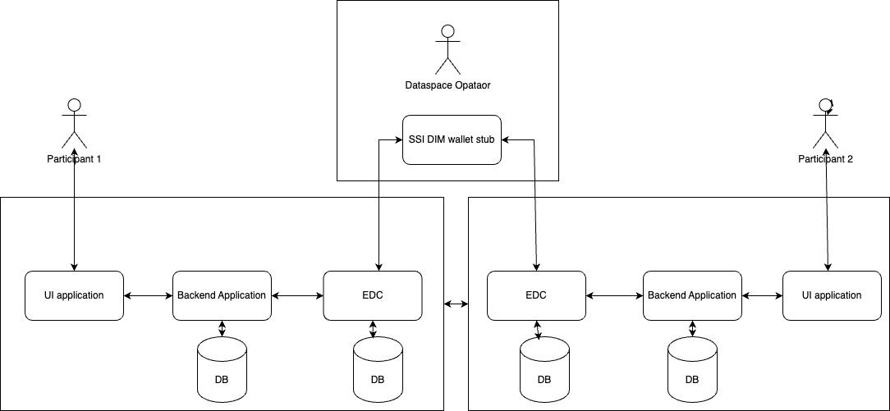

# Chat application using EDC

This is a reference implementation of Chat application utilizing data transfer using EDC.
This definition is part of [Third Eclipse Tractus-X Community Days](https://eclipse-tractusx.github.io/blog/community-days-12-2024).

In this POC, lets assume We have two dataspace participant named with smartSense and Catena-X and they want to chat(Data transfer) with each other.  

### Table of Business Partner Numbers (BPNs)

The following table lists Business Partner Numbers (BPNs) associated with different entities. BPNs are unique identifiers used in various business ecosystems, such as Catena-X, to identify organizations and their digital identities.

| **Entity Name** | **BPN**          | **Description**                                                                        |
|-----------------|------------------|----------------------------------------------------------------------------------------|
| smartSense      | BPNL00SMARTSENSE | Represents the BPN assigned to smartSense. We can also consider as sender/producer     |
| Catena-X        | BPNL00000CATENAX | Represents the BPN assigned to the Catena-X. We can also consider as receier/consumer. |
| Tractus-X       | BPNL0000TRACTUSX | Dataspace operator or trusted issuer                                                   |

*Note: This is just to set the context of the application, you can transfer data vice versa(smartSense to Catena-X or Catena-X to smartSense) and You can also register a third participant (EDC).* 

## Tools and technology
- Java - Spring boot
- ReactJs
- WebSocket
- [EDC - 0.7.7](https://github.com/eclipse-tractusx/tractusx-edc)
- [SSI Dim Wallet stub - 0.0.4](https://github.com/eclipse-tractusx/ssi-dim-wallet-stub)
- Hashicorp Vault
- Docker and Docker compose for local deployment using docker compose

## High level architecture

We have multiple participants in Eclipse Tractus-x dataspace, let's assume We have two business partner(smartSense/Catena-X) and they want to chat/transfer messages. 

Both partners need to have the following application installed:

1. EDC 
2. Backend application, this will connect UI application with EDC and used for custom data management 
3. UI application
4. PostgreSQL Database
5. Hashicorp Vault

There will be some operator company(trusted issuer) which will host following components:

1. SSI Dim wallet stub application

#### Note: 
- We need to expose wallet stub on `https` URL as while verification of VP token, EDC will resolve DID document on `https`. You can use `ngrok` or `tunnelmol` for this purpose.
- Alternatively, You can use hosted wallet stub application on https://wallet.learn.smartsenselabs.com for testing purpose.
- Wallets have been generated for BPN BPNL00SMARTSENSE, BPNL00000CATENAX, and BPNL0000TRACTUSX, accessible at https://wallet.learn.smartsenselabs.com

### High level diagram 

## Run in local IDE
### How to Start the Backend Application [edc-chat-app-backend]

Please refer [README.md](edc-chat-app-backend/README.md)

### How to Start the Chat-App UI [edc-chat-app-ui]

Please refer [README.md](edc-chat-app-ui/README.md)

## Local Deployment using docker compose

Please refer [README.md](deployment/README.md)

## Technical Documentation 

Please refer [technical.md](docs/technical.md)

## Demo

<a href="https://drive.google.com/file/d/1siHmY9dEJ-3U7j8p2KTnltMvW37X01Bv/view?usp=drive_link" target="_blank">Chat application using EDC demo</a>

## Out of scope
- Any authentication and authorization to access chat UI application and to start chat
- EDC discovery service, each participant need to register partner's BPN and EDC DSP URL to start chat
- Fancy UI/UX
- Deployment using helm
- Negative scenarios
- Any kind of Unit test in code

## Note
- There will be latency in transfer chat message due to contract negotiation and transfer process of the EDC 
