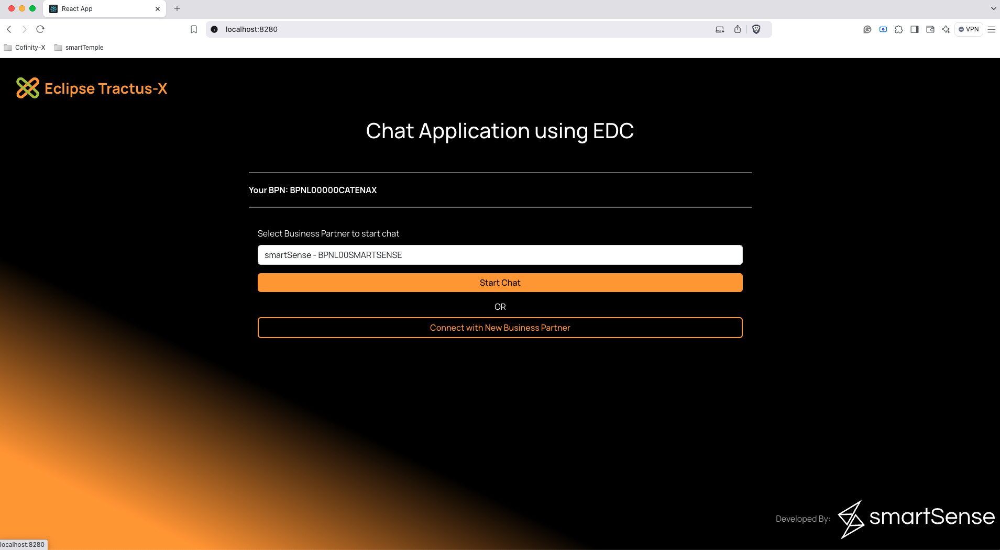
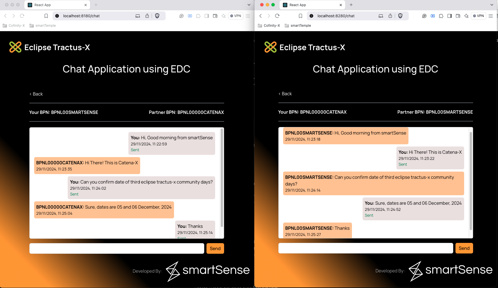
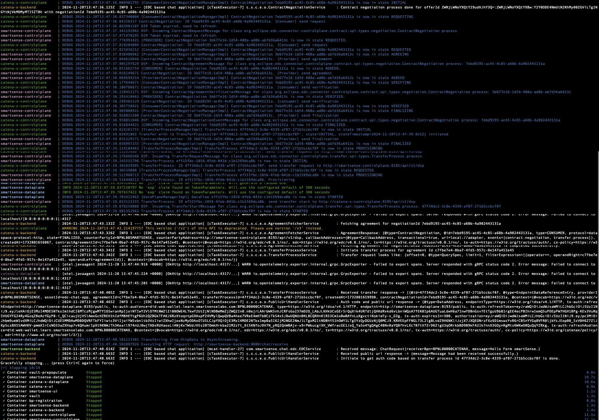

# Deployment Documentation: Chat Application Stack

This document guides the deployment of the complete chat application stack
using [docker-compose.yaml](../docker-compose.yaml). The setup
includes multiple components working together for real-time messaging and data transfer.

---

## Components Deployed

1. **Control Plane (2 instances)**: Manages assets, policies, and contracts.
2. **Data Plane (2 instances)**: Transfers data.
3. **Backend Application (2 instances)**: Supports asset configuration and facilitates communication with the UI.
4. **UI Application (2 instances)**: Provides a real-time chat interface for two business partners.
5. **Vault**: Manages secrets required by the control and data planes.
6. **Postgres Database**: Stores data for EDC and backend applications.
7. **Wallet-Stub (Optional)**: Uncomment in the `docker-compose.yaml` file if needed.

---

## Component Details

### **Vault**

- **Purpose**: Securely stores secrets used by EDC components.
- **Setup**:
    - Uses the `prepopulate_vault.sh` script to automatically migrate secrets during deployment.

### **Postgres**

- **Purpose**: Hosts multiple databases required by EDC and backend applications.
- **Setup**:
    - The `create_database.sh` script creates required databases at startup.
- **Note**:
    - To ensure functionality, manually run the provided `migration.sql` to create EDC-specific tables.
#### For deployment in Windows OS

  - The [create_database.sh](deployment/env/postgres/create_database.sh) needs to be modified. The `chmod +x /docker-entrypoint-initdb.d/create_databases.sh` needs to be removed.
  - Additionally, Windows uses CRLF line separators instead of LF, causing issues while running the init script.
    - To change the line separators in IntelliJ IDEA, go to `File -> File Properties -> Line Separators` and select `LF - Unix and macOS (\n)`.
    - To change the line separators in Notepad++, go to `Edit -> EOL Conversion` and select `Unix (LF)`


### **EDC (Eclipse Data Connector)**

- **Version**: 0.7.7
- **Components**:
    - **Control Plane**: Manages assets, policies, and contracts.
    - **Data Plane**: Transfers data securely between sender and receiver.
- **Deployment**: Configured via `docker-compose.yaml`.

### **Backend Application**

- **Purpose**:
    - Handles asset configuration with URLs for message reception.
    - Communicates with the UI application.
- **Setup**: A separate backend application is deployed for each EDC instance.

**NOTE:**
 
- When the backend application starts, it will create the Asset with id `edc-chat-app`, Policy, and Contract Definition. Please refer `EDCService.initializePreEdcProcess()` for more details
- However, if the assetId as an `edc-chat-app` is already in the edc database, it’ll skip this process.
- Policy is created to check `Membership` credential of  participant. Each participate needs to present `Membership` credential to start data negotiation.


### **UI Application**

- **Purpose**: Provides a WebSocket-enabled interface for real-time chat.
- **Setup**: Each backend application has a corresponding UI instance.

---

## Deployment Instructions

### **Prerequisites**

1. Install Docker and Docker Compose.
2. Clone the repository containing `docker-compose.yaml` and accompanying scripts.

### **Steps to Deploy**

*Note: below steps are tested with `Docker version 27.3.1`*

1. Run the following command to start the deployment:
   ```bash
   docker compose up --build

2. After the deployment the stack will look like below:
   

---

### **How to Access**

1. We can access the UI using the http://localhost:8280 and http://localhost:8180.
2. Select partner from the drop down list.
   
3. Start the chat with the selected business partner.
   
4. When message has been passed then the logs are looks like below:
   

---

### **What to do if backend and UI need to run in local environment?**

1. Comment on the following services from the `docker-compose.yaml` file.
    1. smartsense-backend
    2. catena-x-backend
    3. smartsense-ui
    4. catena-x-ui
2. After commenting this, use the below commands which will deploy the Edc and it's relevant services.
   ```bash
   docker compose up -d

---

### **Troubleshooting**

#### Issue related to database migration or start with fresh data
1. remove the `postgres_data` folder from the root path of the code.
2. Once removal is done, execute the below command.
    ```bash
   docker compose down -v
3. After removing the data and all, we will run the whole stack again with below command.
    ```bash
   docker compose up -d

---

### **NOTE**

The **wallet-stub** service is currently deployed in our shared environment
at:[wallet-stub](https://wallet.learn.smartsenselabs.com/ui/swagger-ui/index.html).

- Make sure your wallet is created in [Wallet stub application](https://wallet.learn.smartsenselabs.com/ui/swagger-ui/index.html) if you are changing or register new BPNs before starting data transfer/chat.
- You can create wallets just by calling ``https://wallet.learn.smartsenselabs.com/yourBPN/did.json`` URL in the browser.

If you want to deploy the wallet-stub service in your local environment, follow these steps:

1. Open the `docker-compose.yaml` file in your project directory.
2. Locate the `wallet-stub` service configuration within the file.
3. Uncomment the `wallet-stub` service block.
4. Expose port `80` with ngrok and update the above host with the ngrok url.
5. Run the Docker Compose command to start the services:
   ```bash
   docker compose up -d
